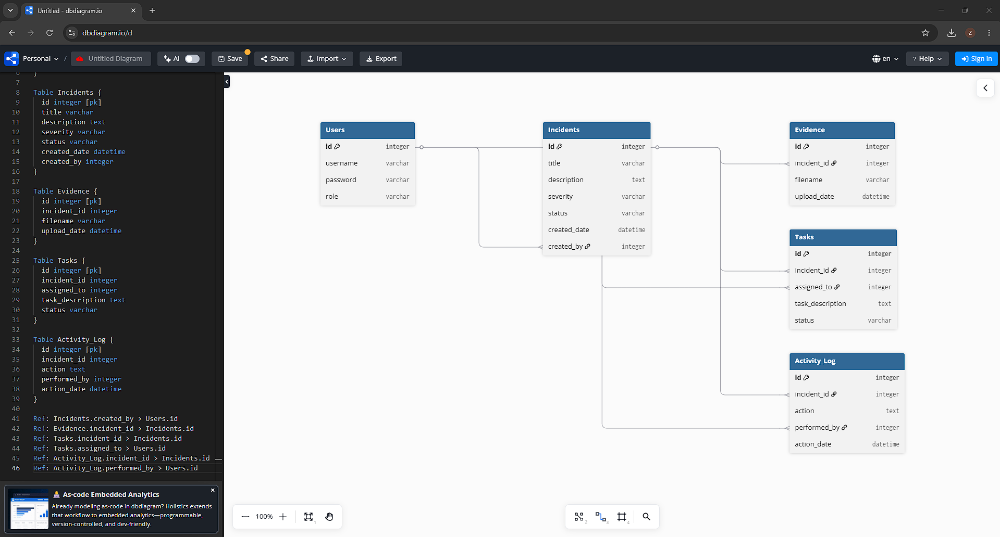
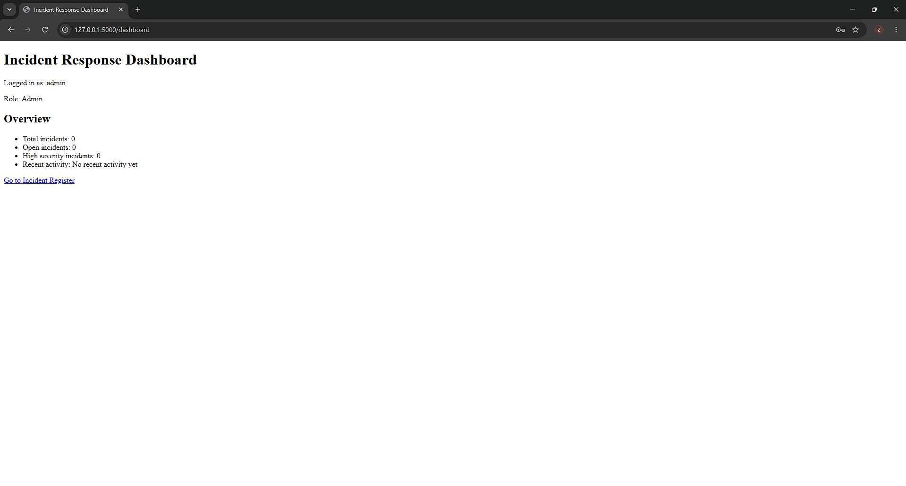
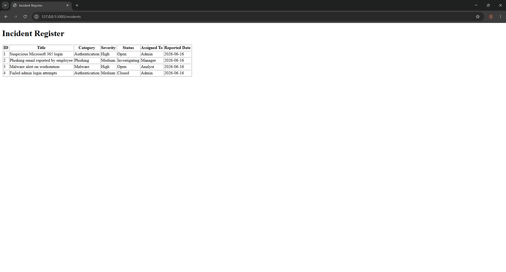
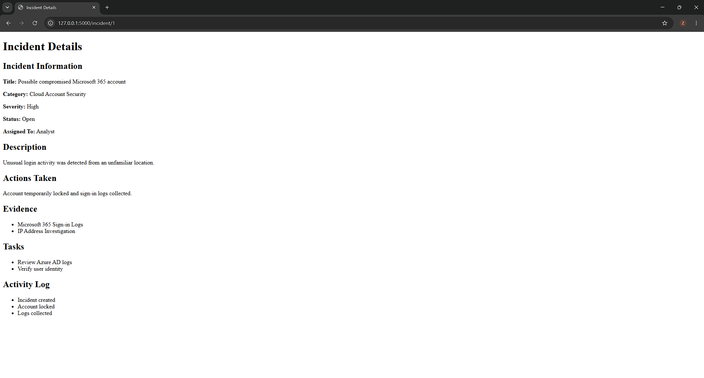
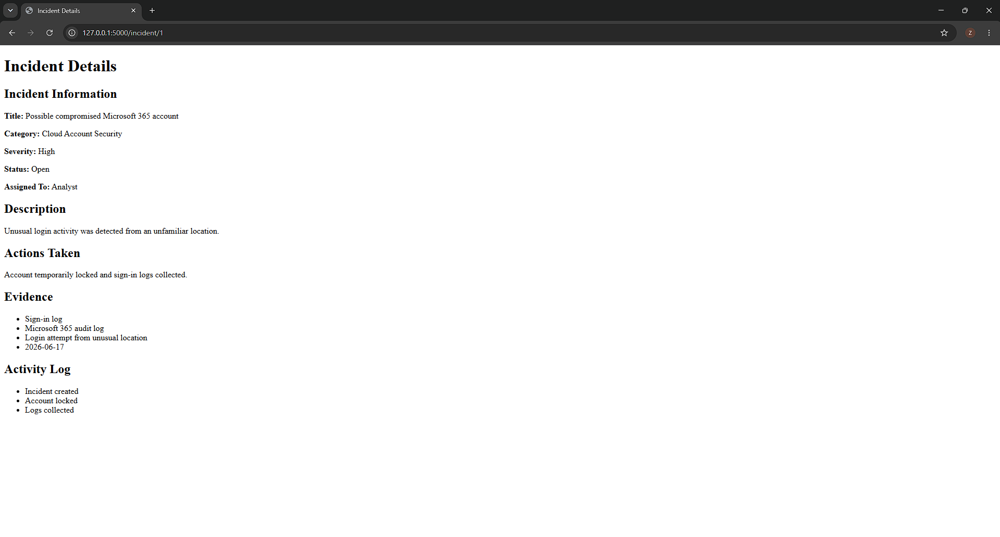
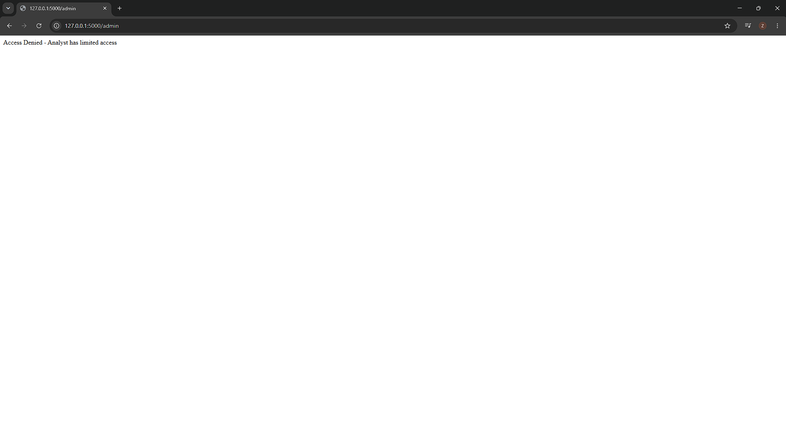
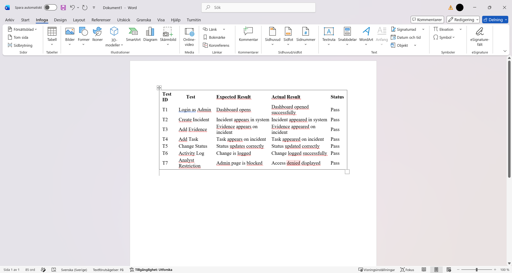
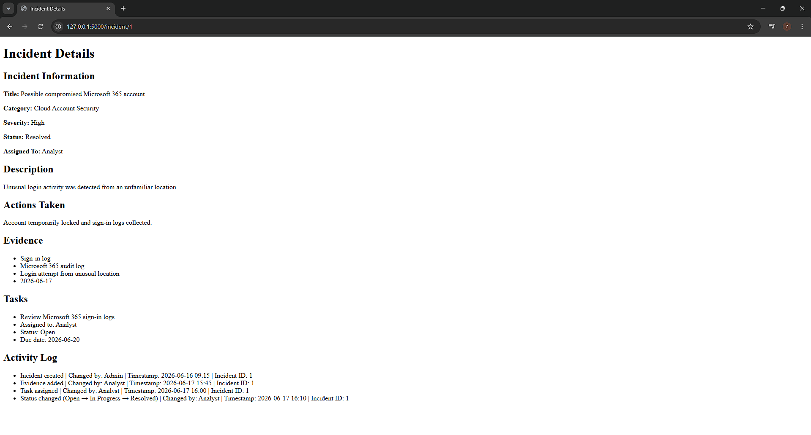

# Incident Response Management System

A web-based cybersecurity Incident Response Management System developed as a proof-of-concept using Python Flask and SQLite.

The project demonstrates how security teams can register, investigate, document, track, and manage cybersecurity incidents through a centralized web application.

The system includes authentication, role-based access control (RBAC), incident management, evidence handling, task assignment, status tracking, and activity logging.

---

## Project Overview

Cybersecurity incidents require structured processes for investigation, documentation, coordination, and follow-up.

This project was designed to simulate a basic incident response platform where security teams can manage incidents throughout their lifecycle.

The application allows users to:

- Log in using different user roles
- Register cybersecurity incidents
- Assign incidents to analysts
- Categorize incidents by severity and status
- Add and manage evidence
- Create investigation tasks
- Track incident progress
- Maintain activity logs and audit trails
- Restrict access using Role-Based Access Control (RBAC)

---

## Technologies Used

- Python
- Flask
- SQLite
- HTML
- CSS
- Werkzeug Security
- DB Browser for SQLite
- Visual Studio Code

---

## Role-Based Access Control

The system implements three different user roles:

### Administrator
Has full access to the system and administrative functions.

### Incident Manager
Responsible for coordinating investigations and monitoring incident progress.

### Analyst
Works with investigation tasks, evidence, incident updates, and documentation.

RBAC is used to restrict protected functionality and demonstrate the principle of least privilege.

---

## Incident Response Workflow

The system supports a structured incident management workflow:

1. A cybersecurity incident is registered.
2. Severity and status are assigned.
3. An analyst is assigned to the incident.
4. Evidence is collected and documented.
5. Investigation tasks are created and assigned.
6. Incident status is updated during the investigation.
7. Important actions are recorded in the activity log.
8. The incident can eventually be marked as resolved.

---

## Database Design

The application uses SQLite to store information related to users, incidents, evidence, investigation tasks, and activity logs.

The database relationships were planned using an Entity Relationship Diagram (ERD).

---

## Incident Response Dashboard

The dashboard provides an overview of the current security situation and displays information such as incident totals, open incidents, high-severity incidents, and recent activity.

---

## Incident Register

The Incident Register provides a centralized overview of reported cybersecurity incidents.

Each incident contains information such as:

- Title
- Category
- Severity
- Status
- Assigned analyst
- Reported date

---

## Incident Investigation

Each incident has a dedicated detail page containing investigation information, actions taken, evidence, tasks, and activity history.

---

## Evidence Management

Investigators can document evidence collected during an investigation.

Evidence can include sources such as:

- Authentication logs
- Microsoft 365 audit logs
- Security alerts
- Investigation findings
- Other digital evidence

Evidence is connected directly to the relevant incident.

---

## Activity Logging and Audit Trail

Important actions performed during an investigation are recorded in the activity log.

The audit trail can show:

- What action was performed
- Which user performed the action
- Timestamp
- Related incident
- Status changes

This provides traceability throughout the investigation lifecycle.

---

## Access Control

The application restricts protected functionality depending on the user's role.

For example, an Analyst attempting to access an Administrator-only page is denied access.

---

## Testing

The system was tested to verify the main functionality of the application.

Tests included:

- Administrator login
- Incident creation
- Evidence management
- Task creation
- Incident status changes
- Activity logging
- Analyst access restrictions

The implemented test cases produced the expected results.

---

## Final System Overview

The finished proof-of-concept demonstrates how a centralized web application can support cybersecurity incident response through structured documentation, investigation coordination, access control, and traceability.

---

## Security Features

The project demonstrates several security concepts:

- Authentication
- Session management
- Role-Based Access Control (RBAC)
- Principle of least privilege
- Password security
- Protected administrative functionality
- Activity logging
- Audit trails

---

## Project Scope

This application was developed as an educational proof-of-concept and is not intended to be a production-ready enterprise incident response platform.

Advanced capabilities such as SIEM integration, automated threat detection, cloud deployment, MFA, real-time alerting, and enterprise case-management integrations were outside the scope of the project.

---

## Author

**Zaid Al Jaderi**

Cybersecurity / Network & IT Security
